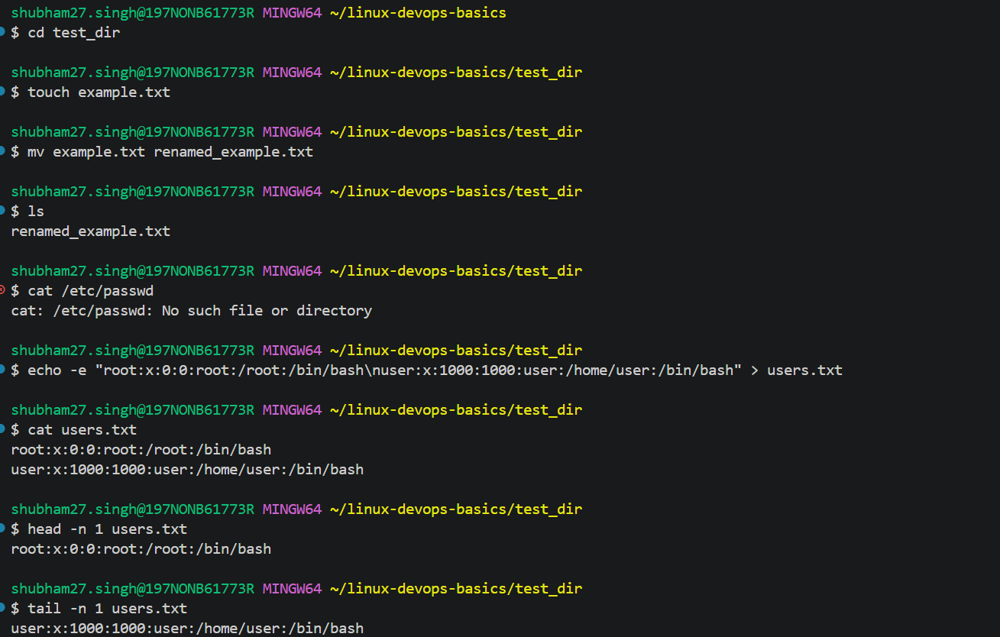
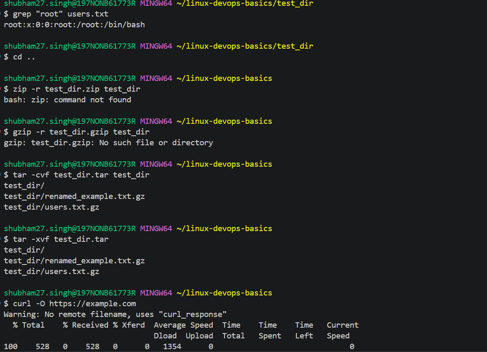
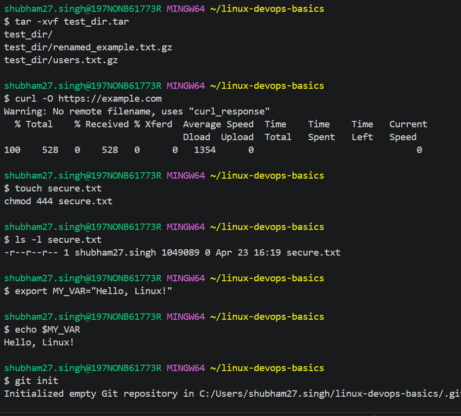

# Linux DevOps Basics

This project demonstrates fundamental Linux commands used in DevOps workflows, along with practical execution in a real environment.

---

##  Topics Covered

- File and directory management
- Viewing file contents
- Pattern searching using grep
- Archiving and extraction (tar)
- File download using curl
- File permissions
- Environment variables

---

## 🛠 Commands Demonstrated

### 1. File & Directory Operations
- mkdir, cd, touch, mv

### 2. File Viewing
- cat, head, tail

### 3. Pattern Search
- grep

### 4. Archiving
- tar (used instead of zip due to environment limitations)

### 5. Downloading Files
- curl (alternative to wget)

### 6. Permissions
- chmod 444 (read-only access)

### 7. Environment Variables
- export and usage

---

##  Note

Some Linux commands like `/etc/passwd`, `zip`, and `wget` were adapted due to environment limitations (Windows + Git Bash). Equivalent alternatives were used to demonstrate the same concepts.

---

##  Project Structure
linux-devops-basics/
│
├── commands/
│ └── linux_commands.sh
│
├── screenshots/
│
└── README.md

---

## Key Learnings

- Practical understanding of Linux commands
- Handling environment limitations
- Adapting tools in DevOps workflows
- Basic scripting and automation

## Screenshots

### File & Directory Operations

### Grep

### Permissions
