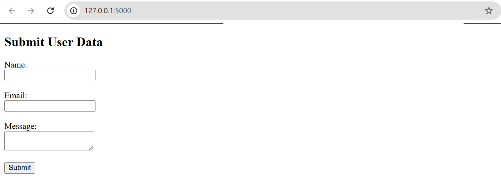
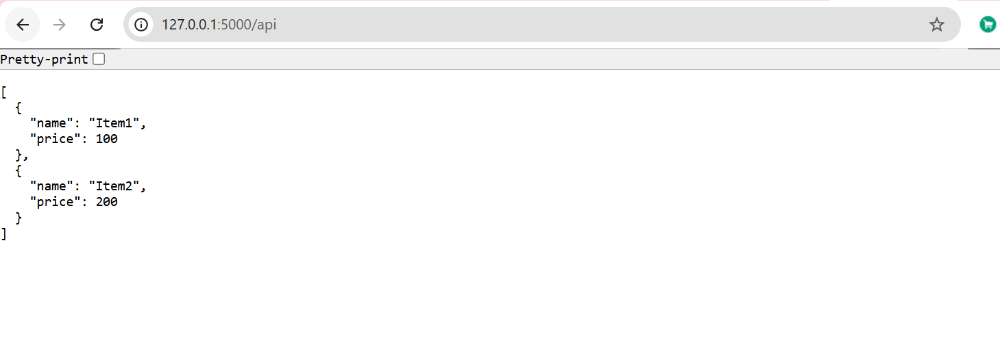
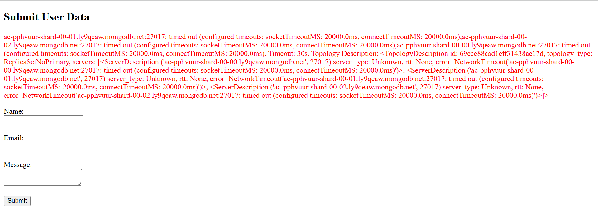

# 🌐 Flask MongoDB Application

A simple Flask-based web application that demonstrates API development, form handling, MongoDB integration, and error handling.

---

## 🚀 Features

- /api route returns JSON data from backend file  
- User form to submit data  
- Data is attempted to be stored in MongoDB Atlas  
- Redirects to success page on submission  
- Displays error on same page if submission fails  

---

## 🛠️ Technologies Used

- Python  
- Flask  
- MongoDB Atlas  
- PyMongo  
- HTML (Frontend)  

---

## ▶️ How to Run

pip install -r requirements.txt  
python app.py  

Open in browser:  
http://127.0.0.1:5000  

---

## 📸 Screenshots

### Form

### API

### Error Handling

---

## 📂 Project Structure

flask-mongodb-app/
├── app.py
├── data/
│   └── items.json
├── templates/
│   ├── index.html
│   └── success.html
├── static/
├── screenshots/
│   ├── form.png
│   ├── api.png
│   └── error.png
├── requirements.txt
└── README.md

---

## 💡 Notes

- MongoDB connection may fail due to firewall/network restrictions blocking port 27017  
- The application correctly handles this by displaying the error on the same page  

---

## 💡 Future Improvements

- Enable successful MongoDB connection in unrestricted network  
- Add data validation  
- Improve UI design  
- Deploy application on cloud (AWS/Render)  