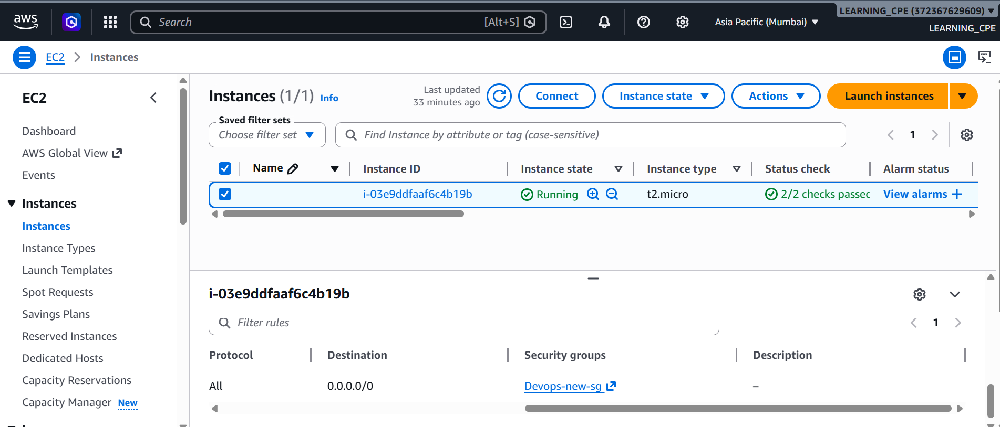
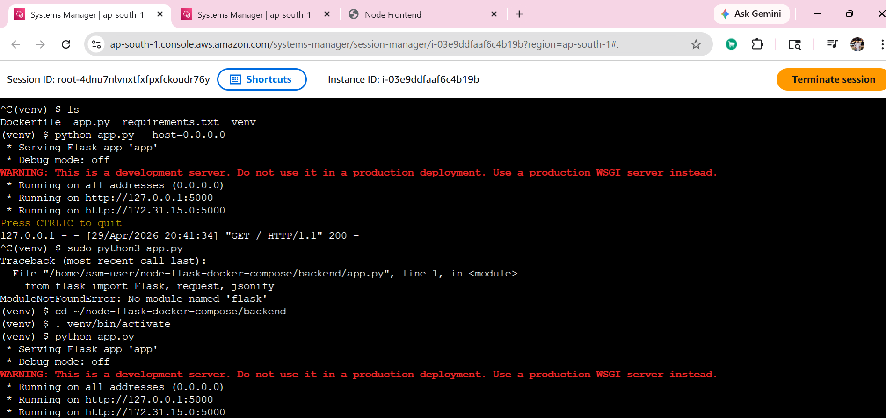
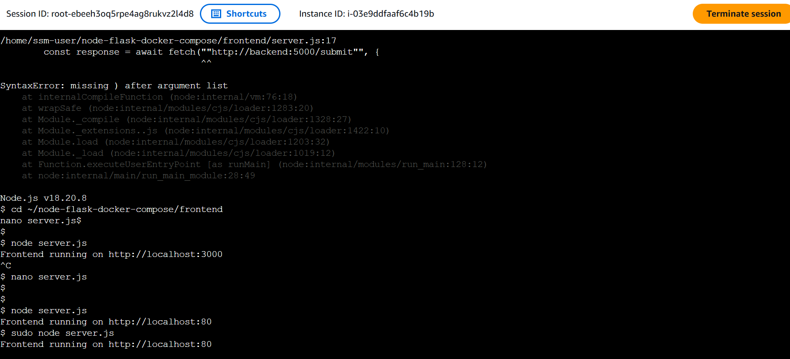
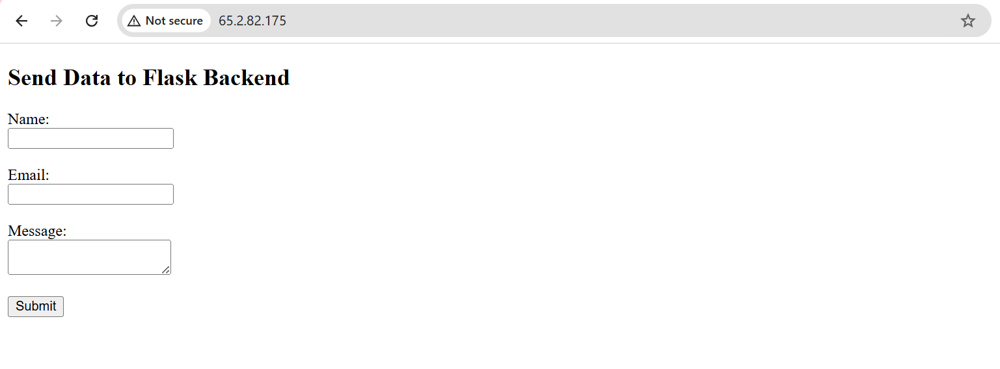
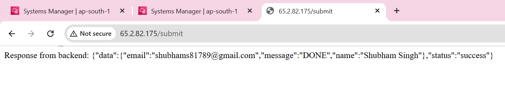

# AWS Deployment - Part 1: Single EC2 Instance

## Objective

Deploy both Flask backend and Node.js Express frontend on a single Amazon EC2 instance.

## Services Used

- Amazon EC2
- Security Group
- AWS Systems Manager Session Manager
- Ubuntu Server
- Python Flask
- Node.js Express

## Deployment Steps

1. Created an EC2 instance using Ubuntu 24.04 LTS.
2. Attached IAM role with AmazonSSMManagedInstanceCore policy.
3. Connected to EC2 using Session Manager.
4. Installed Python, pip, Node.js, and npm.
5. Cloned GitHub repository on EC2.
6. Created Python virtual environment for Flask backend.
7. Installed backend dependencies.
8. Started Flask backend on port 5000.
9. Installed frontend dependencies.
10. Updated frontend backend URL to use 127.0.0.1.
11. Ran Node.js frontend on port 80.
12. Accessed application using EC2 public IPv4 address.

## Security Group Rules

- HTTP: 80
- Custom TCP: 3000
- Custom TCP: 5000

## Screenshots

### EC2 Running

### Backend Running

### Frontend Running

### Application in Browser

### Form Response

## Note

The frontend and backend were deployed on the same EC2 instance. The frontend was exposed on port 80 for browser access, while the backend ran locally on port 5000 and was accessed by the frontend using 127.0.0.1.