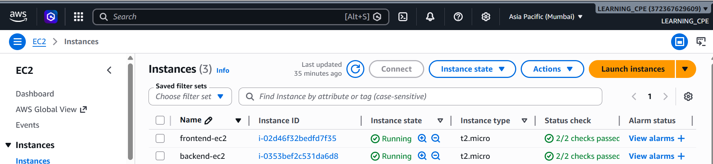
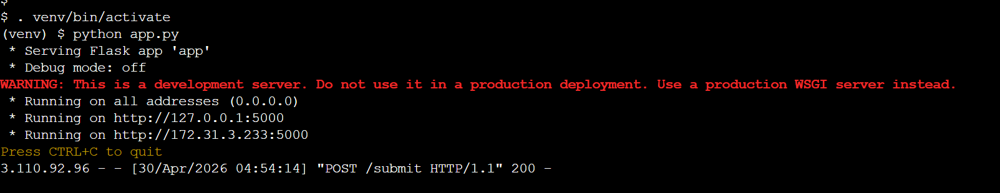
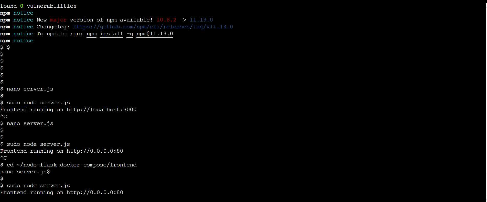
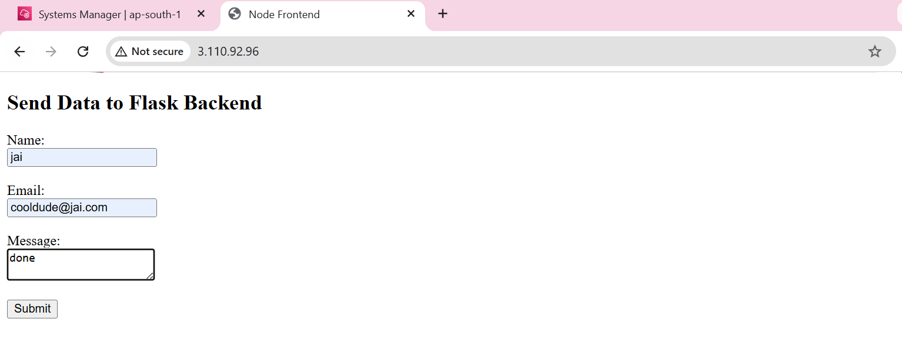
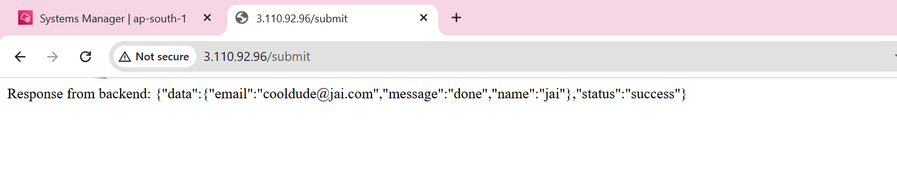

# 🚀 Part 2: Two EC2 Deployment (Frontend + Backend)

## 📌 Overview
In this part, the application was deployed using two separate EC2 instances:

- Backend EC2 → Runs Flask API (Port 5000)
- Frontend EC2 → Runs Node.js server (Port 80)

The frontend communicates with the backend using the backend's public IP address.

---

## 🏗️ Architecture
User (Browser)
↓
Frontend EC2 (Node.js - Port 80)
↓
Backend EC2 (Flask - Port 5000)

---

## ⚙️ Steps Performed

### 1. Backend EC2 Setup
- Launched EC2 instance (Ubuntu)
- Installed Python & dependencies
- Created virtual environment
- Installed requirements
- Ran Flask app

Commands:
sudo apt update
sudo apt install python3-venv -y

python3 -m venv venv
. venv/bin/activate

pip install -r requirements.txt
python app.py --host=0.0.0.0

---

### 2. Backend Security Group
Allowed inbound traffic:
- Port 5000 (Custom TCP) → 0.0.0.0/0

---

### 3. Frontend EC2 Setup
- Launched second EC2 instance
- Installed Node.js
- Installed dependencies
- Updated backend API URL

Commands:
npm install
sudo node server.js

---

### 4. Frontend Code Change (Important)
Updated backend URL inside server.js:

const response = await fetch("http://<BACKEND_PUBLIC_IP>:5000/submit", {

---

### 5. Frontend Security Group
Allowed inbound traffic:
- Port 80 (HTTP) → 0.0.0.0/0

---

## 🧪 Testing

Backend test:
curl http://<BACKEND_PUBLIC_IP>:5000

Frontend test:
http://<FRONTEND_PUBLIC_IP>

---

## 📸 Screenshots

### Both EC2 Instances Running

### Backend Terminal

### Frontend Terminal

### Frontend Browser

### Form Submission Response

---

## ⚠️ Issues Faced & Fixes

Issue: Backend not accessible in browser  
Fix: Added security group rule for port 5000 and ran Flask on 0.0.0.0  

Issue: "fetch failed" error  
Fix: Updated backend IP in frontend code and ensured backend is running  

Issue: Port not accessible  
Fix: Opened required ports in security group  

---

## ✅ Outcome
- Successfully deployed frontend and backend on separate EC2 instances  
- Achieved end-to-end communication  
- Application works via public browser access  

---

## 📌 Key Learnings
- Security Groups configuration  
- EC2 networking basics  
- Public vs Private IP usage  
- Cross-instance communication  
- Debugging deployment issues  

---

## 🛑 Cleanup
Stopped both EC2 instances to avoid charges  

---

## 📎 Note
This setup is for learning purposes. In production, use Load Balancer, HTTPS, and NGINX.