# 🚀 Part 3: ECS Fargate Deployment with Application Load Balancer

## 📌 Overview
In this phase, the application is deployed using **AWS ECS (Fargate)** and exposed to the internet using an **Application Load Balancer (ALB)**.

This setup represents a **production-like architecture** where containers are managed without directly managing servers.

---

## 🧱 Architecture

User → Frontend ALB (HTTP:80)  
↓  
Frontend ECS Fargate Service (Node.js - Port 3000)  
↓  
Backend ALB (HTTP:80)  
↓  
Backend ECS Fargate Service (Flask - Port 5000)

---

## 🧰 AWS Services Used

- Amazon ECS (Fargate)
- Amazon ECR
- Application Load Balancer (ALB)
- Target Groups
- CloudWatch Logs
- Security Groups
- VPC Networking

---

## 🔨 Implementation Steps

### 1️⃣ Docker & ECR Setup
- Built Docker images for:
  - Flask Backend
  - Node.js Frontend
- Tagged and pushed images to AWS ECR
- Verified images in ECR repositories

---

### 2️⃣ ECS Cluster & Task Definitions
- Created ECS Cluster using Fargate
- Created separate Task Definitions for:
  - Backend Container
  - Frontend Container
- Configured:
  - CPU & Memory
  - Container ports
  - Logging with CloudWatch

---

### 3️⃣ Backend ECS Deployment
- Created backend ECS Service
- Enabled public networking
- Configured security group for port 5000
- Initially accessed backend using Public IP

---

### 4️⃣ Issue Faced 🚧
Backend was not accessible using Public IP even though:
- Container was running
- Logs showed app running on 0.0.0.0:5000

Frontend was also unable to communicate with backend initially.

---

### 5️⃣ Solution ✅
#### Backend Fix
- Created Target Group for backend
- Created Backend ALB
- Configured Listener Rules
- Attached ECS backend service to Target Group

#### Frontend Fix
- Updated frontend API URL to backend ALB DNS
- Built and pushed updated frontend Docker image
- Created Frontend ECS Service
- Created Frontend Target Group
- Created Frontend ALB
- Attached frontend ECS service to ALB

---

## 🎯 Final Result

- Frontend accessible through ALB DNS
- Frontend successfully communicating with backend
- Form submission working successfully
- ECS services running properly behind ALB

---

## 📸 Screenshots

### ECS Cluster
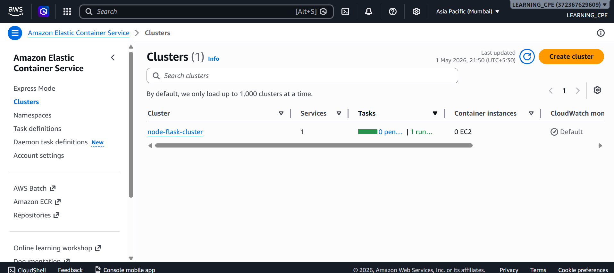

### Task Definition
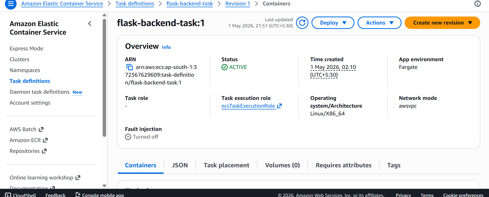

### ECS Service Running
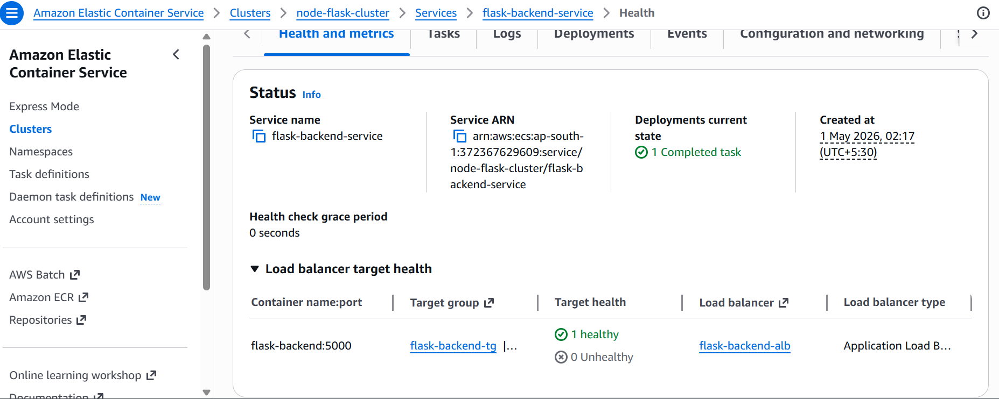

### Target Group Healthy
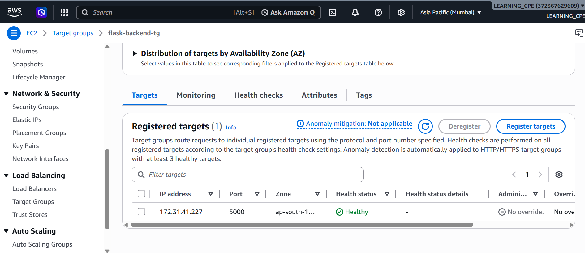

### ALB Created
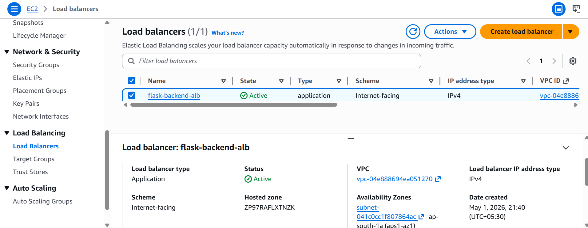

### Listener Configuration
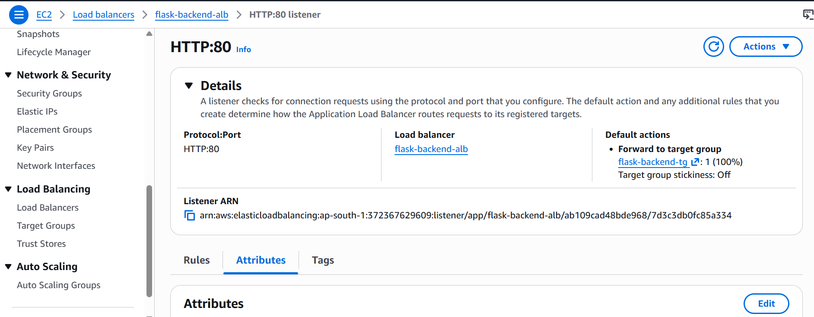

### Backend Working
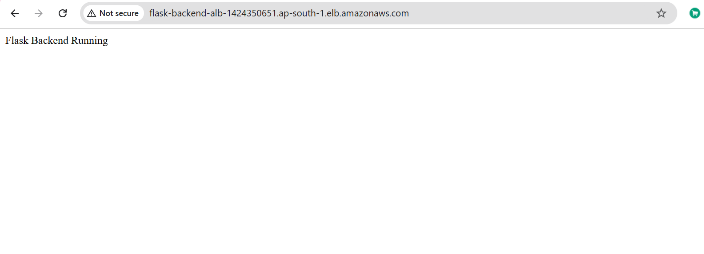

### Frontend Working
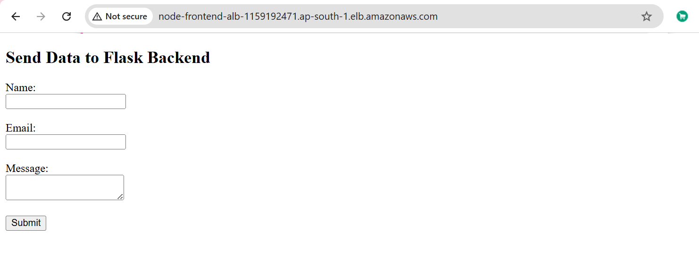

### Successful Form Submission
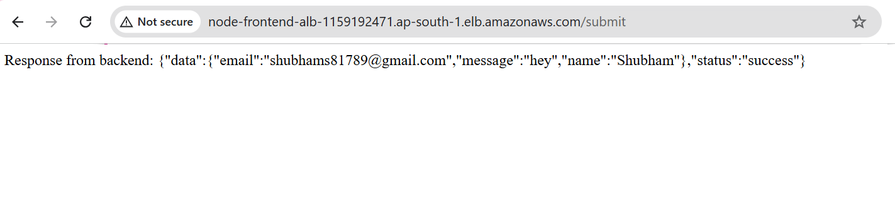

### Frontend Target Healthy
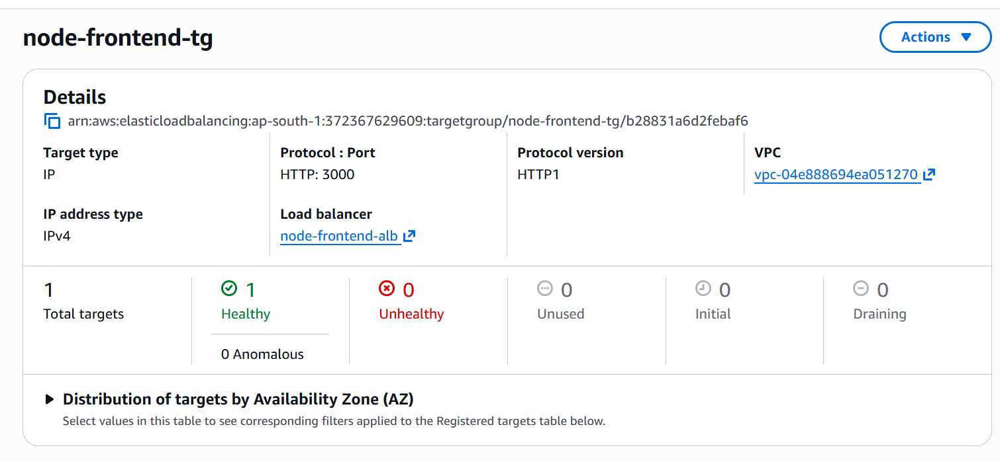

### Frontend ECS Service Running
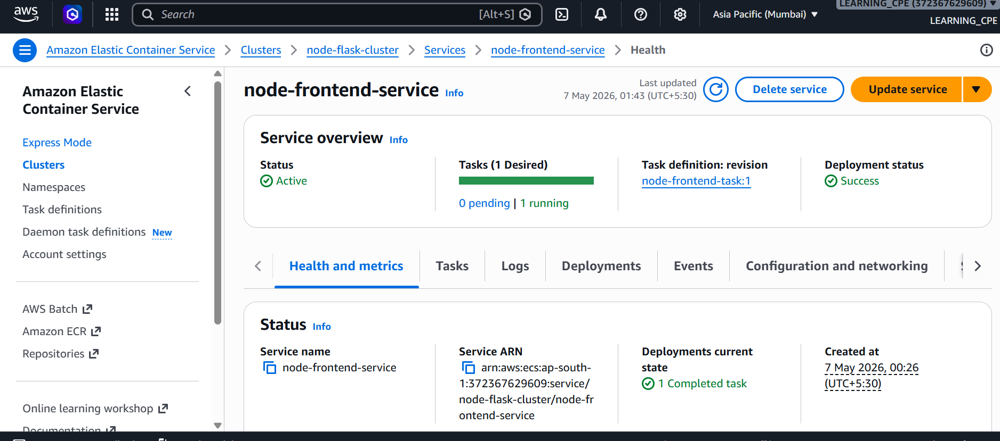

---

## 🌐 Final Output

### Frontend URL
http://node-frontend-alb-1159192471.ap-south-1.elb.amazonaws.com

### Backend URL
http://flask-backend-alb-1424350651.ap-south-1.elb.amazonaws.com

---

## 🧠 Key Learnings

- ECS Fargate deployment workflow
- Difference between EC2 and serverless container deployment
- Container networking in AWS ECS
- Load Balancer integration with ECS
- Debugging ECS networking and security group issues
- Docker image management with ECR
- Frontend ↔ Backend communication using ALB

---

## ⚠️ Notes

- Flask development server used for learning purposes
- In production:
  - Use Gunicorn
  - Add HTTPS/SSL
  - Enable Auto Scaling
  - Use Route53 custom domain
  - Use CI/CD pipelines

---

## 👨‍💻 Author

Shubham Singh