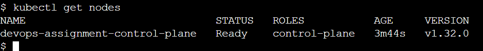
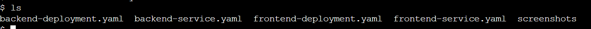
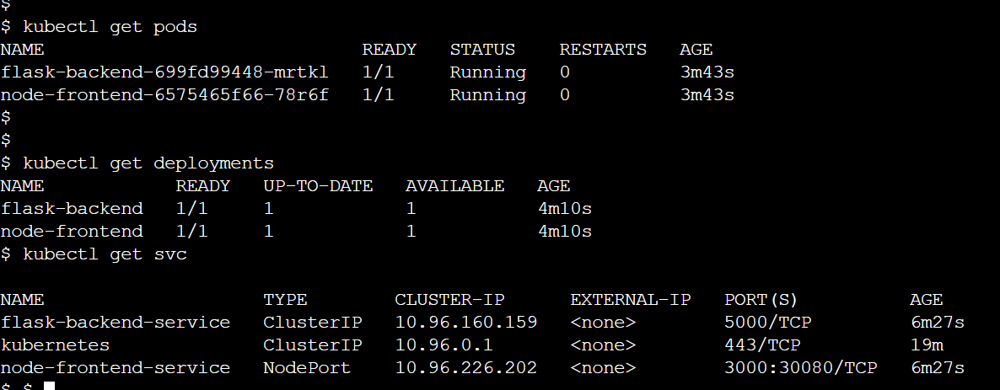
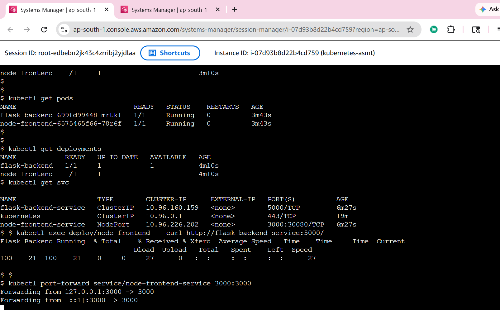
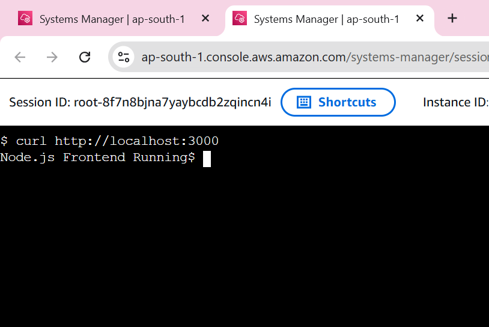

# Kubernetes Deployment using kind

## Project Overview

This project demonstrates deployment of a Node.js frontend and Flask backend application on a Kubernetes cluster using kind.

The application was containerized and deployed using Kubernetes Deployments and Services. The frontend communicates with the backend service internally within the Kubernetes cluster.

---

## Technologies Used

- Kubernetes
- kind
- Docker
- Node.js
- Express.js
- Flask
- kubectl

---

## Project Structure

```text
kubernetes-minikube/
├── backend-deployment.yaml
├── backend-service.yaml
├── frontend-deployment.yaml
├── frontend-service.yaml
├── README.md
└── screenshots/
```

---

## Kubernetes Components

### Backend Deployment

- Flask backend application
- Runs on port `5000`
- Deployed using Kubernetes Deployment
- Exposed internally using `ClusterIP` service

### Frontend Deployment

- Node.js Express frontend application
- Runs on port `3000`
- Deployed using Kubernetes Deployment
- Exposed using `NodePort` service

---

## Kubernetes Cluster Creation

### Install and Create kind Cluster

```bash
kind create cluster --name devops-assignment
```

---

## Apply Kubernetes YAML Files

```bash
kubectl apply -f .
```

---

## Verify Kubernetes Resources

### Check Deployments

```bash
kubectl get deployments
```

### Check Pods

```bash
kubectl get pods
```

### Check Services

```bash
kubectl get svc
```

---

## Port Forwarding

```bash
kubectl port-forward service/node-frontend-service 3000:3000
```

---

## Backend Service Communication Test

```bash
kubectl exec deploy/node-frontend -- curl http://flask-backend-service:5000/
```

Expected Output:

```text
Flask Backend Running
```

---

## Frontend Output Test

```bash
curl http://localhost:3000
```

Expected Output:

```text
Node.js Frontend Running
```

---

# Screenshots

## Kubernetes Cluster Running



---

## Kubernetes YAML Files



---

## Deployments, Pods and Services



---

## Kubernetes Application Working



---

## Frontend Running on Localhost



---

# Final Output

## Frontend

```text
Node.js Frontend Running
```

## Backend

```text
Flask Backend Running
```

---

# GitHub Repository

GitHub Repo:

```text
https://github.com/Shubhams260/linux-devops-basics
```