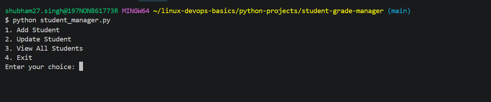
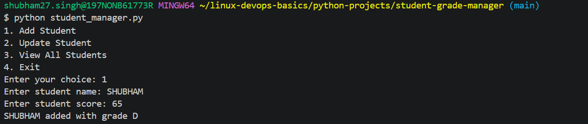
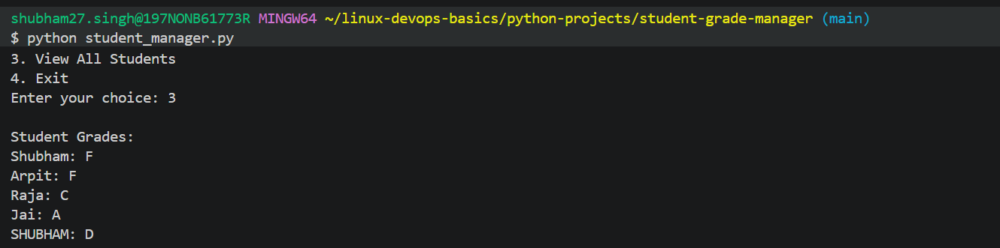

# 🎓 Student Grade Manager (CLI Tool)

A simple command-line application built using Python to manage student grades.  
This tool allows users to add, update, and view student records with persistent storage.

---

## 🚀 Features

- Add new student with grade calculation
- Update existing student grades
- View all student records
- Data persistence using file handling

---

## 🛠️ Technologies Used

- Python
- File Handling
- CLI (Command Line Interface)

---

## ▶️ How to Run

```bash
python student_manager.py
```

---

## 📸 Screenshots

### Main Menu


### Add Student


### View Students


---

## 📂 Project Structure

```text
student-grade-manager/
├── student_manager.py
├── students.txt
├── screenshots/
│   ├── menu.png
│   ├── add_student.png
│   └── view_students.png
└── README.md
```

---

## 💡 Future Improvements

- Add delete student functionality
- Store data using a database
- Add web-based UI using Flask
- Add input validation