# Jenkins CI/CD Deployment Project

## Project Overview

This project demonstrates a complete CI/CD deployment workflow using Jenkins on AWS EC2 for a Flask backend and Express frontend application.

The project includes:

- EC2 provisioning using Terraform
- Flask backend deployment
- Express frontend deployment
- PM2 process management
- Jenkins CI/CD pipelines
- Automated deployment workflow
- GitHub integration
- Deployment verification using Jenkins pipelines

---

# Architecture

```text
GitHub Repository
        │
        ▼
Jenkins Pipelines
        │
        ▼
Pull Latest Code
        │
        ▼
Install Dependencies
        │
        ▼
Restart Applications using PM2
        │
        ▼
Flask Backend + Express Frontend on EC2
```

---

# Tech Stack

- AWS EC2
- Terraform
- Jenkins
- Python Flask
- Node.js Express
- PM2
- GitHub
- Ubuntu 24.04 LTS

---

# AWS Infrastructure

## EC2 Configuration

| Component | Value |
|---|---|
| Region | ap-south-1 |
| AMI | Ubuntu 24.04 LTS |
| Instance Type | t2.micro |
| Storage | 20 GB gp3 |

---

# Security Group Configuration

| Port | Purpose |
|---|---|
| 22 | SSH |
| 8080 | Jenkins |
| 5000 | Flask Backend |
| 3000 | Express Frontend |

---

# Project Structure

```text
terraform-jenkins-devops-project/
│
├── apps/
│   ├── flask-backend/
│   └── express-frontend/
│
├── terraform/
│
├── jenkins-cicd/
│   ├── screenshots/
│   └── README.md
```

---

# Terraform Setup

Terraform was used to provision the EC2 instance and security group.

## Terraform Files

- main.tf
- variables.tf
- outputs.tf

## Terraform Commands

```bash
terraform init
terraform validate
terraform plan
terraform apply
```

---

# Server Configuration

The following packages were installed on the EC2 instance:

- Git
- Python3
- pip
- Node.js
- npm
- PM2
- OpenJDK 21
- Jenkins

---

# Swap Memory Configuration

Since Jenkins was deployed on a t2.micro instance, swap memory was configured to avoid memory issues.

```bash
sudo fallocate -l 2G /swapfile
sudo chmod 600 /swapfile
sudo mkswap /swapfile
sudo swapon /swapfile
```

---

# Flask Backend Deployment

## Flask Application Path

```text
terraform-jenkins-devops-project/apps/flask-backend
```

## Flask Setup

```bash
python3 -m venv venv
source venv/bin/activate
pip install -r requirements.txt
```

## PM2 Command

```bash
pm2 start "venv/bin/python app.py" --name flask-backend
```

---

# Express Frontend Deployment

## Express Application Path

```text
terraform-jenkins-devops-project/apps/express-frontend
```

## Express Setup

```bash
npm install
```

## PM2 Command

```bash
pm2 start server.js --name express-frontend
```

---

# Jenkins Installation

Jenkins was installed using the official Jenkins repository.

## Jenkins Access

```text
http://<EC2-PUBLIC-IP>:8080
```

---

# Jenkins Pipelines

Two separate Jenkins pipelines were created:

1. flask-pipeline
2. express-pipeline

---

# Flask Pipeline Stages

- Pull latest GitHub code
- Install Python dependencies
- Restart Flask application using PM2
- Verify deployment

---

# Express Pipeline Stages

- Pull latest GitHub code
- Install Node.js dependencies
- Restart Express application using PM2
- Verify deployment

---

# CI/CD Workflow

```text
Developer Pushes Code to GitHub
                │
                ▼
        Jenkins Pipeline Trigger
                │
                ▼
        Pull Latest Code
                │
                ▼
      Install Dependencies
                │
                ▼
       Restart Applications
                │
                ▼
       Verify Deployment
```

---

# GitHub Integration

GitHub integration was configured in Jenkins.

Build trigger configuration was added using:

```text
Poll SCM
```

---

# PM2 Process Management

PM2 was used to keep applications running persistently.

## PM2 Commands

```bash
pm2 list
pm2 restart flask-backend
pm2 restart express-frontend
pm2 save
```

---

# Deployment Verification

Applications were verified using:

```bash
curl http://localhost:5000
curl http://localhost:3000
```

Public IP verification was also tested successfully.

---

# Screenshots

## EC2

- EC2 instance running
- CloudShell access
- Terminal connection
- Terraform apply success
- PM2 running applications

## Jenkins

- Jenkins unlock page
- Jenkins dashboard
- Plugin installation
- GitHub plugin configuration

## Pipelines

- Flask pipeline success
- Express pipeline success
- Jenkins build trigger configuration

---

# Challenges Faced

## EC2 SSH Connectivity

- EC2 Instance Connect failed
- SSH was blocked on the company laptop
- AWS CloudShell was used as a workaround

## Jenkins Java Compatibility

- Jenkins required Java 21
- Java 17 caused Jenkins service startup failure
- OpenJDK 21 fixed the issue

## t2.micro Memory Limitation

- Jenkins consumed significant memory
- Swap memory was configured for stability

## Git Permissions in Jenkins

- Jenkins user faced Git ownership and permission issues
- Repository ownership and permissions were updated

---

# Learning Outcomes

- Terraform provisioning
- Jenkins CI/CD pipelines
- PM2 process management
- Flask deployment
- Express deployment
- AWS EC2 administration
- GitHub integration
- Linux troubleshooting
- CI/CD workflow implementation

---

# Cost Optimization

To avoid AWS charges:

- EC2 instances were stopped after testing
- Only required resources were kept active during development

---

# GitHub Repository

```text
https://github.com/Shubhams260/linux-devops-basics
```

---


# Project Screenshots

## EC2 Setup

### EC2 Instance Running

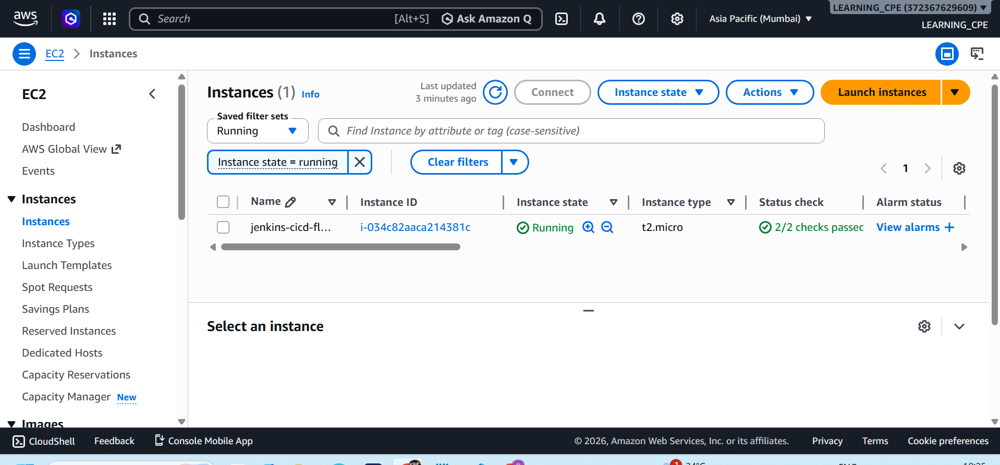

### EC2 Terminal Connected

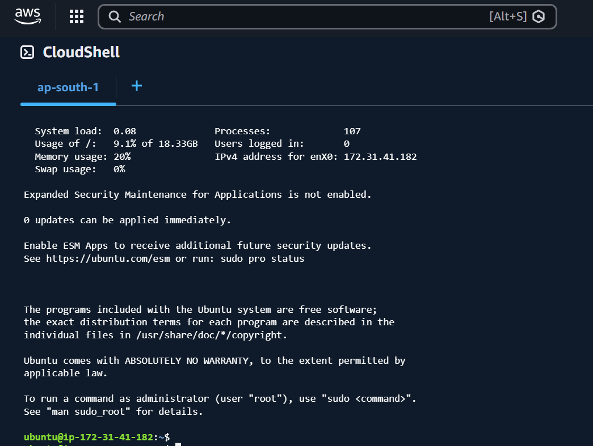

### Terraform Apply Success

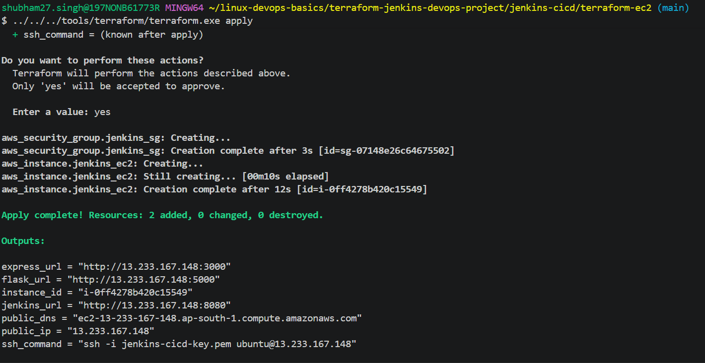

### PM2 Running Applications

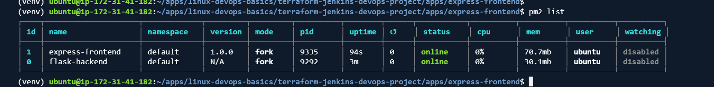

---

## Jenkins Setup

### Jenkins Unlock Page

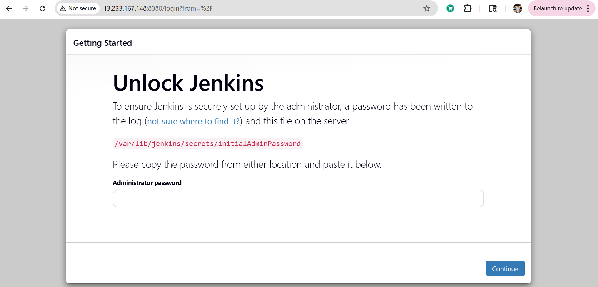

### Jenkins Dashboard

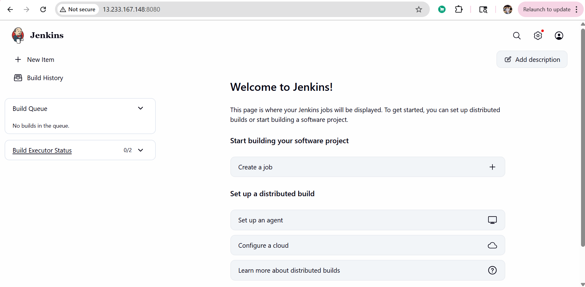

### GitHub Plugin Installed

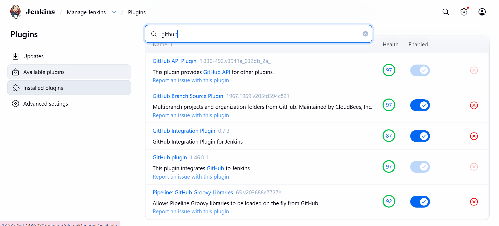

---

## Flask Deployment

### Flask Running in Terminal

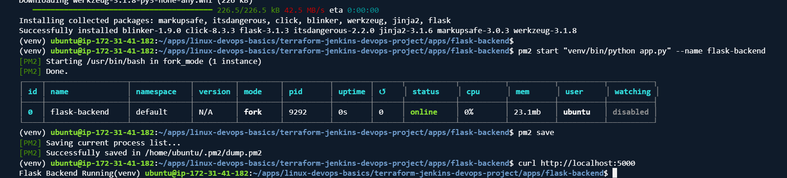

---

## Express Deployment

### Express Running in Terminal

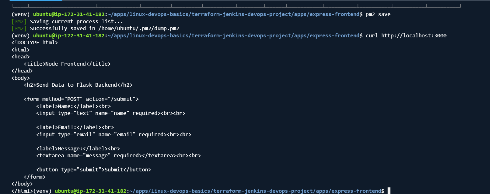

---

## Jenkins Pipelines

### Flask Pipeline Success

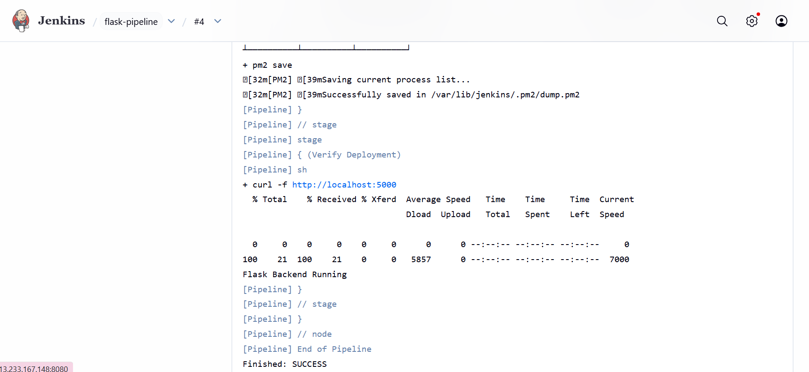

### Express Pipeline Success

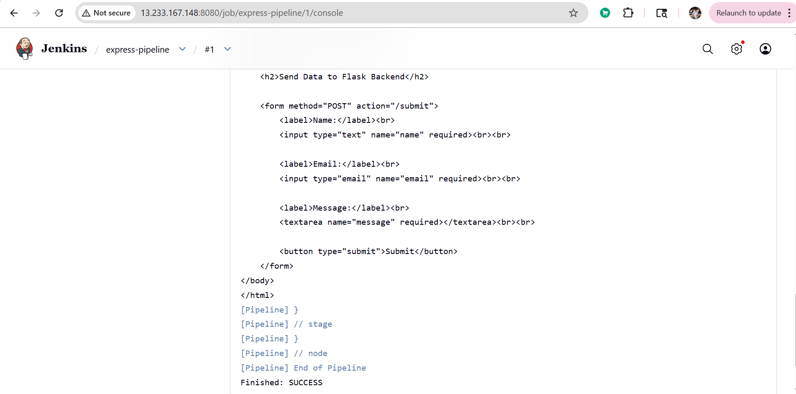

### Jenkins Build Trigger Configuration

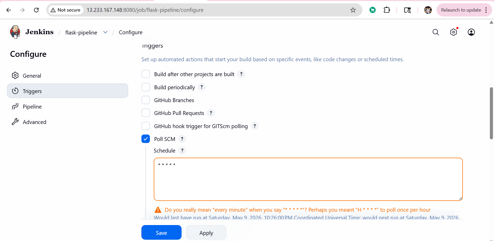

---

# Future Improvements

- Dockerized Jenkins agents
- GitHub webhook based real-time triggering
- Nginx reverse proxy setup
- HTTPS using SSL certificates
- Jenkins shared libraries
- Multi-environment deployment pipelines

---

# Author

Shubham Singh  
DevOps & Cloud Enthusiast
```