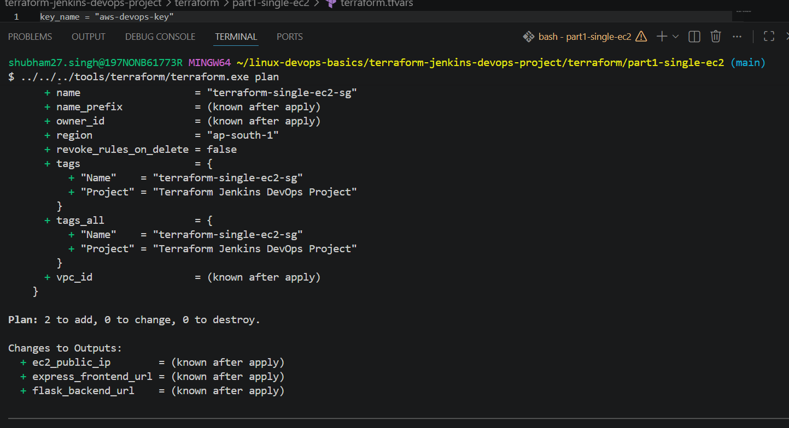
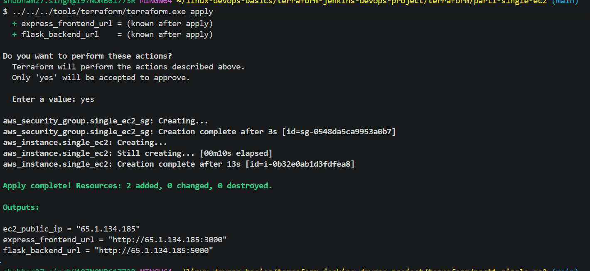
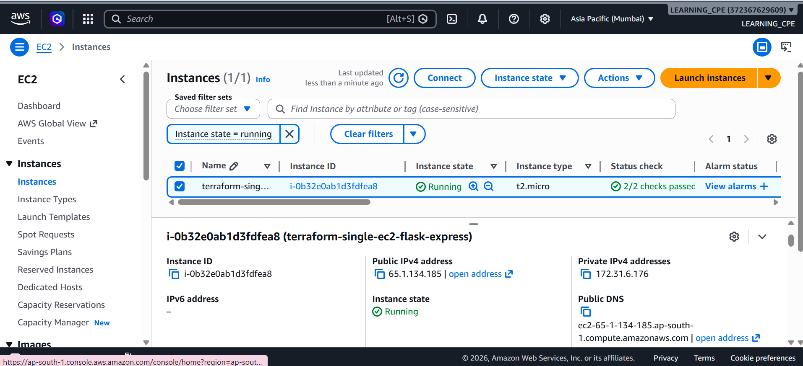
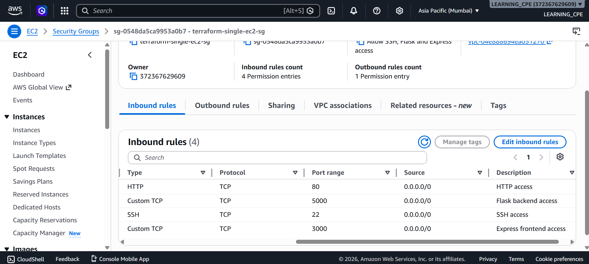
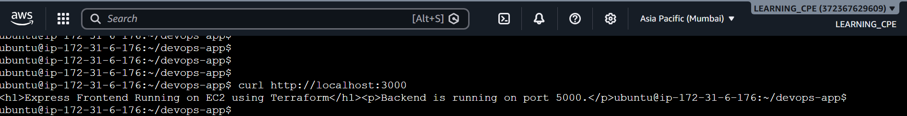
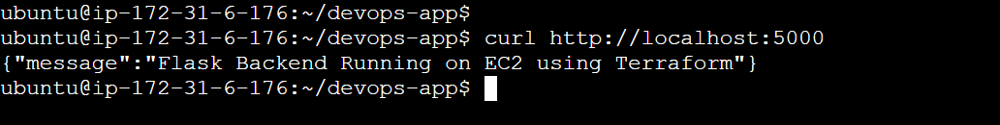

# Part 1 - Single EC2 Deployment using Terraform

This project demonstrates deployment of both a Flask backend application and an Express frontend application on a single AWS EC2 instance using Terraform.

---

# Project Architecture

```text
User Browser
      │
      ▼
Single EC2 Instance
 ├── Express Frontend (Port 3000)
 └── Flask Backend (Port 5000)
```

---

# Technologies Used

- Terraform
- AWS EC2
- AWS Security Groups
- Node.js
- Express.js
- Python Flask
- Git Bash
- AWS CloudShell

---

# Features

- Infrastructure provisioning using Terraform
- Single EC2 deployment
- Express frontend deployment
- Flask backend deployment
- Security group configuration
- Public IP-based application access
- Infrastructure automation

---

# Files Used

```bash
main.tf
variables.tf
outputs.tf
terraform.tfvars
```

---

# Terraform Workflow

## Initialize Terraform

```bash
terraform init
```

## Validate Terraform Configuration

```bash
terraform validate
```

## Review Execution Plan

```bash
terraform plan
```

## Deploy Infrastructure

```bash
terraform apply
```

## Destroy Infrastructure

```bash
terraform destroy
```

---

# Deployment Steps

## 1. Provision EC2 Instance

Terraform creates:
- EC2 instance
- Security Group
- Inbound rules for ports 3000 and 5000

---

## 2. Deploy Frontend Application

Express frontend application runs on:

```text
Port 3000
```

---

## 3. Deploy Backend Application

Flask backend application runs on:

```text
Port 5000
```

---

# Application Testing

Frontend URL:

```text
http://<EC2-PUBLIC-IP>:3000
```

Backend URL:

```text
http://<EC2-PUBLIC-IP>:5000
```

---

# Screenshots

## Terraform Plan



---

## Terraform Apply



---

## EC2 Instance Running



---

## Security Group Rules



---

## Express Frontend Working



---

## Flask Backend Working



---

# Learning Outcomes

This project helped in understanding:

- Terraform basics
- EC2 provisioning
- Security group management
- Infrastructure as Code
- Frontend and backend deployment
- Public application access
- Terraform automation workflow

---

# Author

Shubham Singh