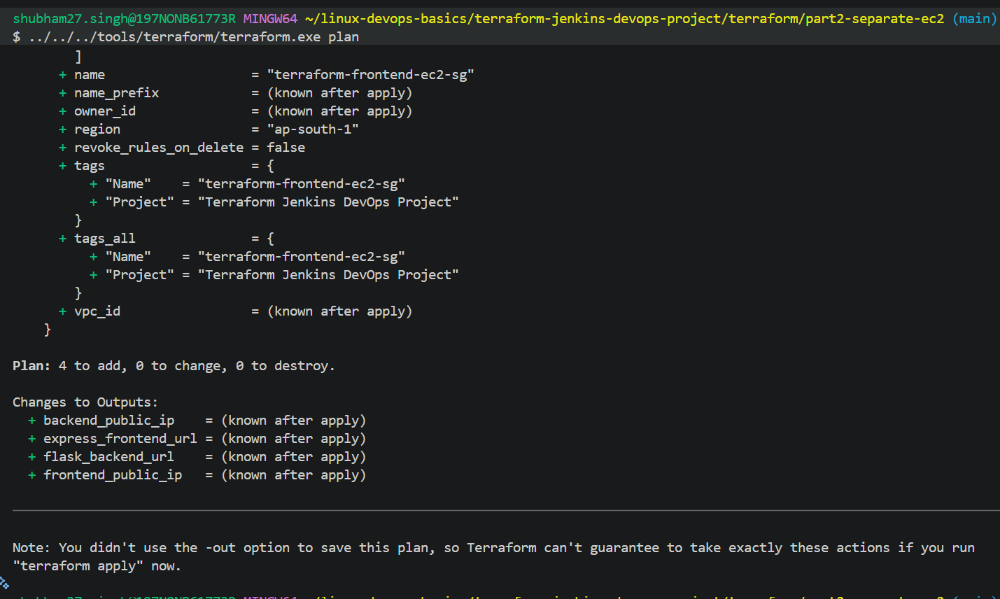
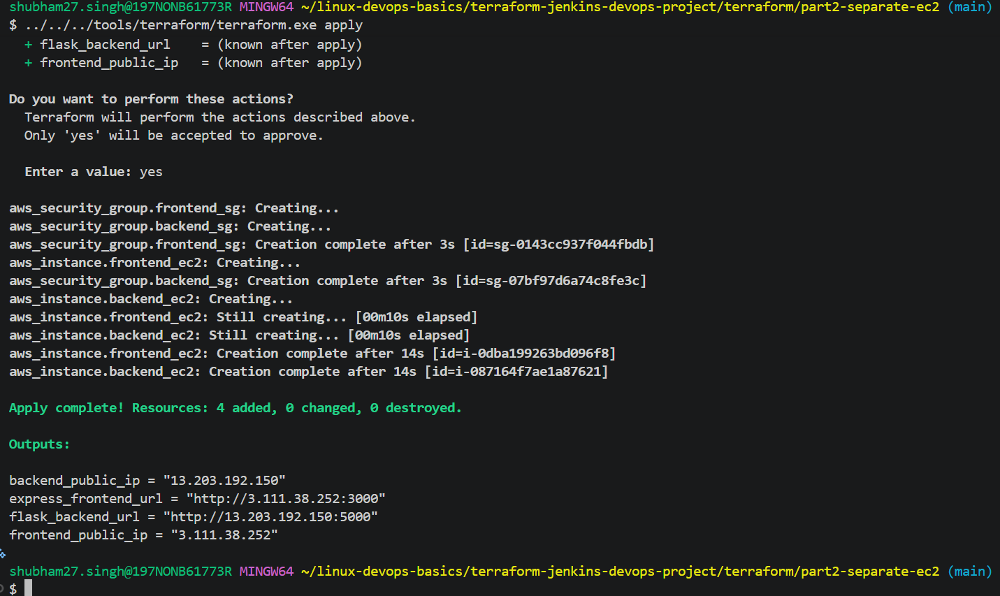
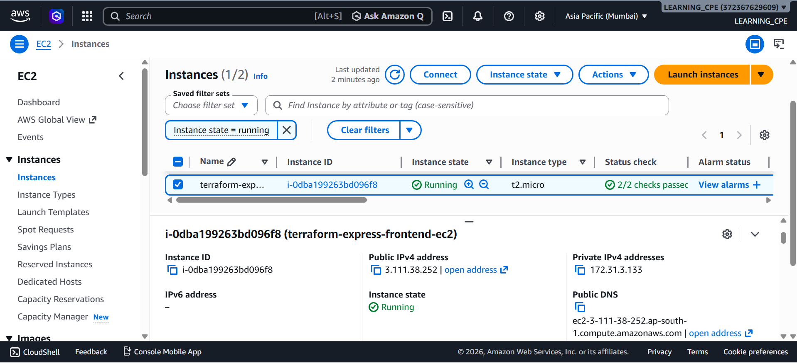
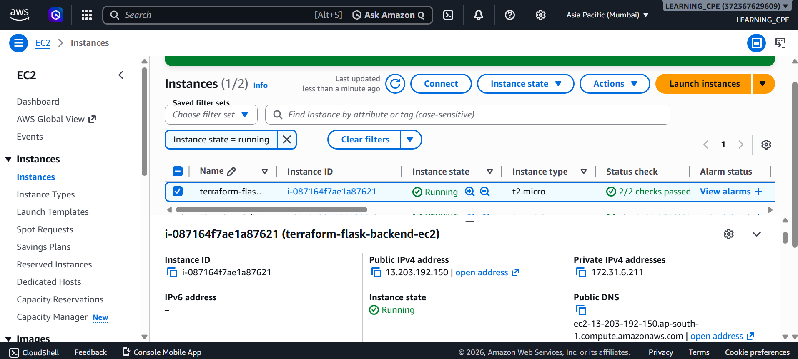
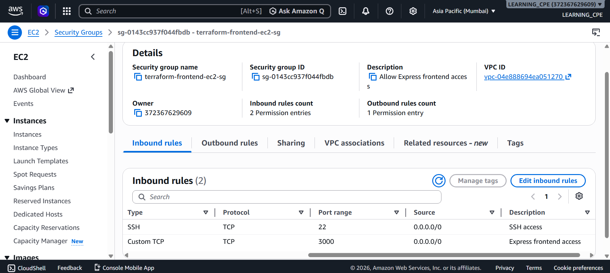
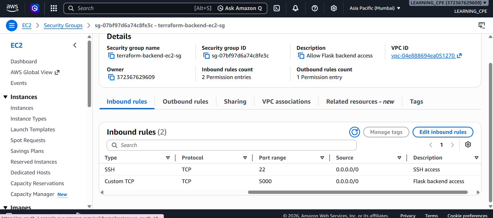
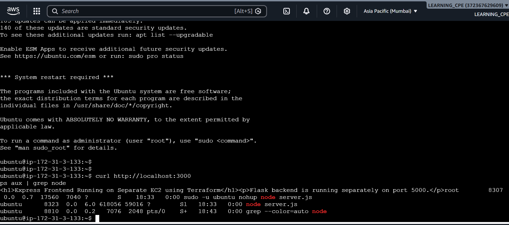
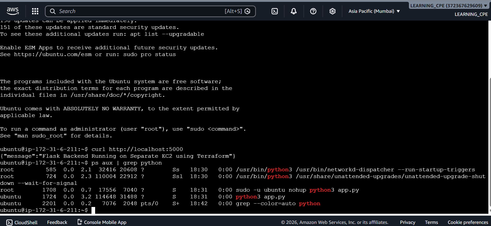

# Part 2 - Separate Frontend and Backend EC2 Deployment using Terraform

This project demonstrates deployment of a frontend Express application and a backend Flask application on separate AWS EC2 instances using Terraform.

---

# Project Architecture

```text
                User Browser
                      │
                      ▼
          Frontend EC2 Instance
             Express App :3000
                      │
                      ▼
           Backend EC2 Instance
               Flask App :5000
```

---

# Technologies Used

- Terraform
- AWS EC2
- AWS Security Groups
- Node.js
- Express.js
- Python Flask
- AWS CloudShell
- Git Bash

---

# Features

- Infrastructure provisioning using Terraform
- Separate frontend and backend EC2 instances
- Independent security groups
- Frontend-backend communication
- Public IP-based deployment
- Infrastructure automation

---

# Files Used

```bash
main.tf
variables.tf
outputs.tf
terraform.tfvars
```

---

# Terraform Workflow

## Initialize Terraform

```bash
terraform init
```

## Validate Terraform Configuration

```bash
terraform validate
```

## Review Execution Plan

```bash
terraform plan
```

## Deploy Infrastructure

```bash
terraform apply
```

## Destroy Infrastructure

```bash
terraform destroy
```

---

# Deployment Steps

## 1. Create Frontend EC2 Instance

Terraform provisions:
- Frontend EC2 instance
- Frontend security group
- Port 3000 access

---

## 2. Create Backend EC2 Instance

Terraform provisions:
- Backend EC2 instance
- Backend security group
- Port 5000 access

---

## 3. Deploy Applications

Frontend:
```text
Express Application
```

Backend:
```text
Flask Application
```

---

# Application Testing

Frontend URL:

```text
http://<FRONTEND-PUBLIC-IP>:3000
```

Backend URL:

```text
http://<BACKEND-PUBLIC-IP>:5000
```

---

# Screenshots

## Terraform Plan



---

## Terraform Apply



---

## Frontend EC2 Running



---

## Backend EC2 Running



---

## Frontend Security Group



---

## Backend Security Group



---

## Frontend Application Working



---

## Backend Application Working



---

# Learning Outcomes

This project helped in understanding:

- Multi-instance infrastructure deployment
- Frontend and backend separation
- Terraform automation
- AWS networking basics
- Security group isolation
- Public application deployment
- Infrastructure scalability concepts

---

# Author

Shubham Singh