# Part 3 - ECS Fargate + ECR + ALB Deployment using Terraform

This project demonstrates deployment of containerized frontend and backend applications on AWS ECS Fargate using Terraform, Docker, ECR, and Application Load Balancer (ALB).

---

# Project Architecture

```text
                    User Browser
                          │
                          ▼
              Application Load Balancer
                          │
          ┌───────────────┴───────────────┐
          ▼                               ▼
Frontend ECS Service              Backend ECS Service
     Express App                       Flask App
          │                               │
          ▼                               ▼
      ECS Fargate                     ECS Fargate
```

---

# Technologies Used

- Terraform
- AWS ECS Fargate
- AWS ECR
- AWS Application Load Balancer (ALB)
- AWS CloudWatch
- AWS VPC
- AWS IAM
- Docker
- Node.js
- Flask
- AWS CloudShell

---

# Features

- Docker containerization
- AWS ECR repositories
- ECS Cluster deployment
- ECS Fargate services
- Application Load Balancer
- Target groups and listeners
- CloudWatch log groups
- VPC and networking setup
- Infrastructure as Code using Terraform

---

# Infrastructure Components

Terraform provisions:

- VPC
- Public Subnets
- Internet Gateway
- Route Tables
- Security Groups
- ECS Cluster
- ECS Task Definitions
- ECS Services
- Application Load Balancer
- Target Groups
- Listener Rules
- CloudWatch Logs
- IAM Roles
- ECR Repositories

---

# Files Used

```bash
main.tf
variables.tf
outputs.tf
terraform.tfvars
```

---

# Terraform Workflow

## Initialize Terraform

```bash
terraform init
```

## Format Terraform Code

```bash
terraform fmt
```

## Validate Configuration

```bash
terraform validate
```

## Review Execution Plan

```bash
terraform plan
```

## Deploy Infrastructure

```bash
terraform apply
```

## Destroy Infrastructure

```bash
terraform destroy
```

---

# Docker Workflow

## Build Docker Images

Frontend:

```bash
docker build -t terraform-ecs-devops-frontend .
```

Backend:

```bash
docker build -t terraform-ecs-devops-backend .
```

---

## Push Images to AWS ECR

```bash
docker push <ECR-IMAGE-URI>
```

---

# Application Deployment

Frontend application is deployed through:
- ECS Fargate
- Application Load Balancer

Backend application:
- Runs as separate ECS service
- Attached to backend target group

---

# Application Testing

Frontend URL:

```text
http://<ALB-DNS-NAME>
```

Backend service:
```text
Accessible through backend target group routing
```

---

# Screenshots

## Terraform Validate

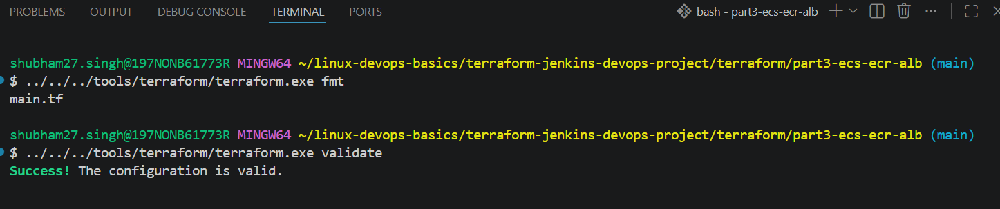

---

## Terraform Plan

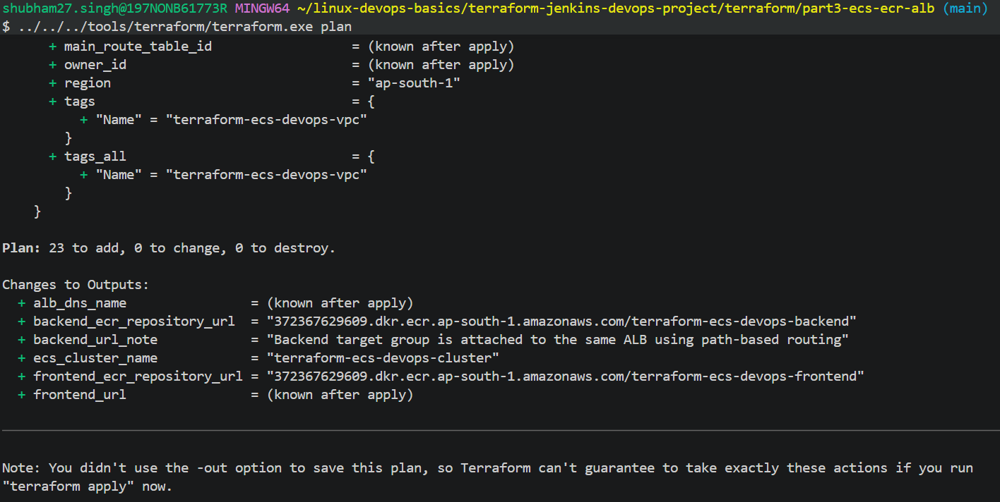

---

## Terraform Apply

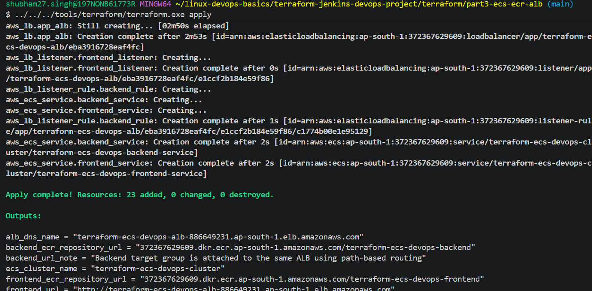

---

## ECR Repositories Created

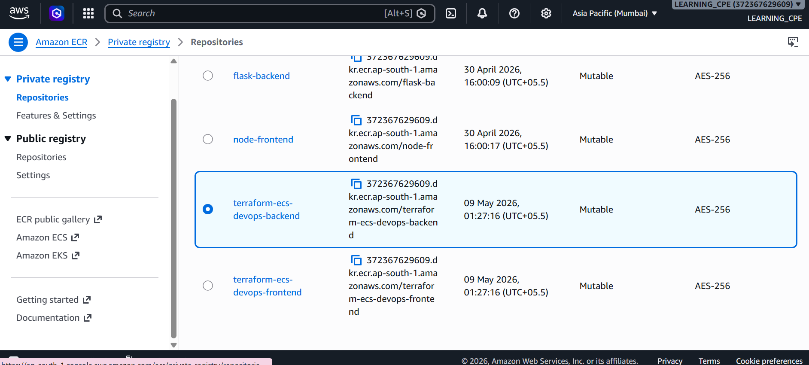

---

## ECR Images Pushed

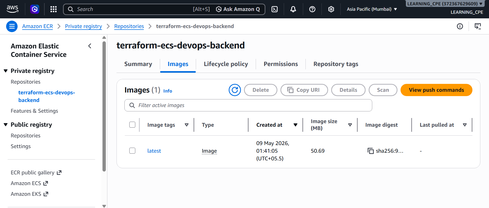

---

## ECS Cluster Running

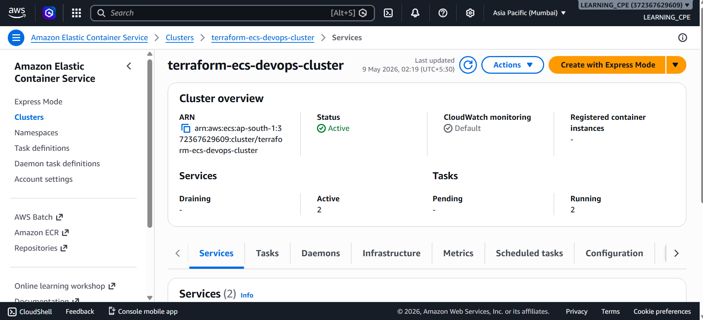

---

## ECS Task Running

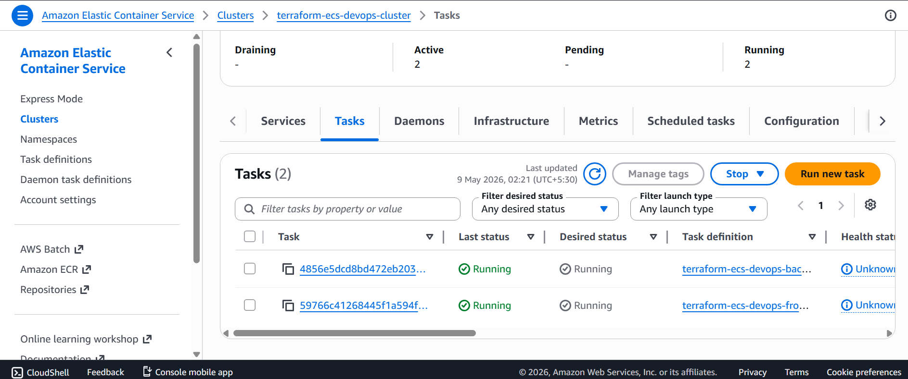

---

## Application Load Balancer

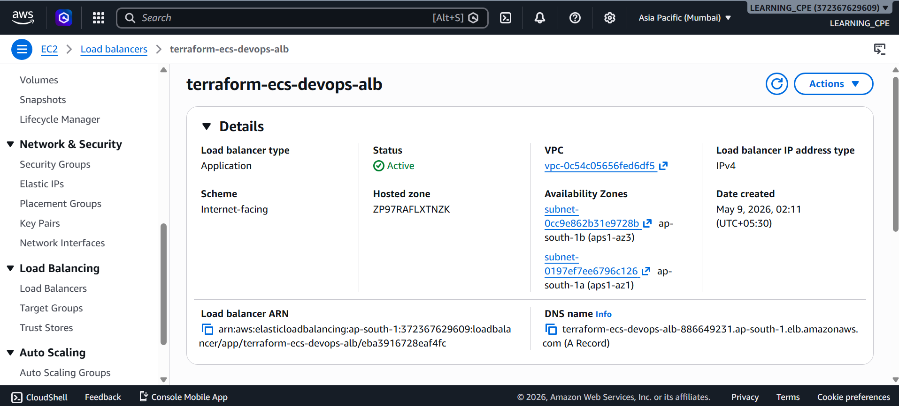

---

## Target Groups Healthy

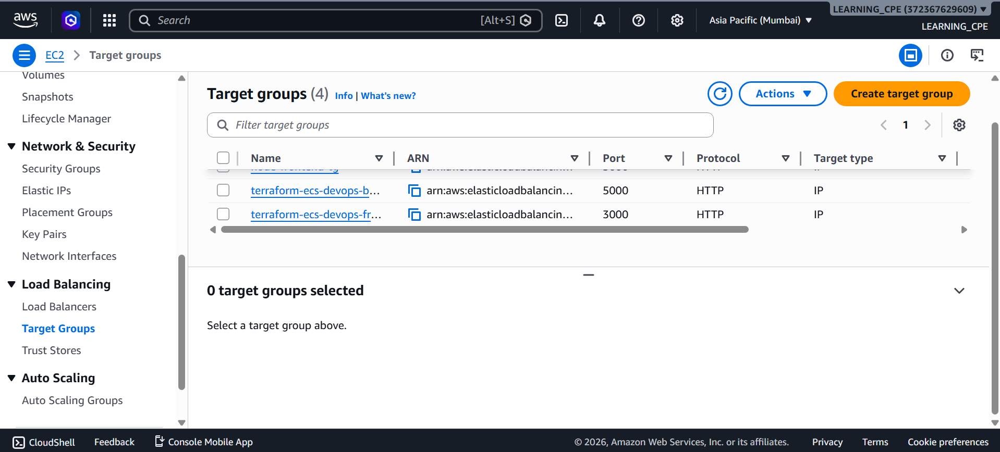

---

## Listener Rules

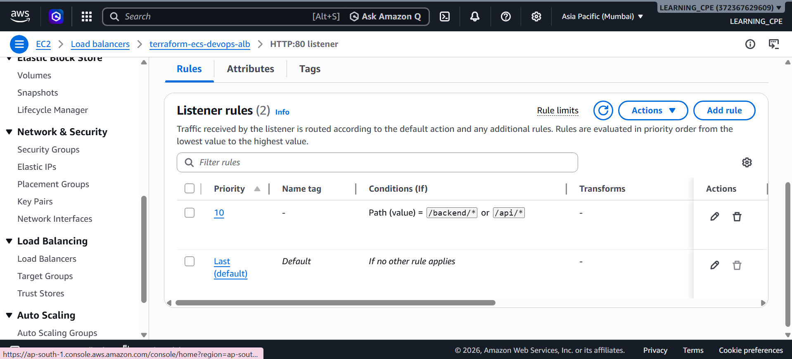

---

## Frontend Working through ALB

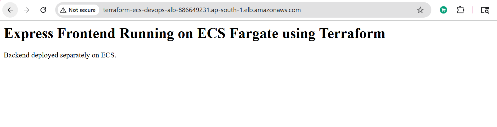

---

## CloudWatch Logs

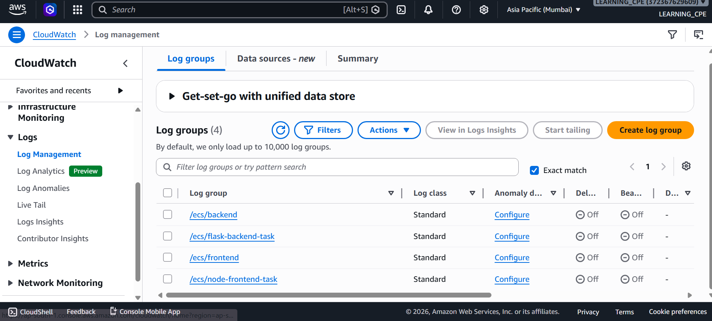

---

# Learning Outcomes

This project helped in understanding:

- Infrastructure as Code (IaC)
- ECS Fargate deployments
- Docker containerization
- ECR image management
- Application Load Balancer configuration
- AWS networking
- ECS task definitions
- CloudWatch logging
- Terraform automation
- Scalable cloud deployments

---

# Author

Shubham Singh